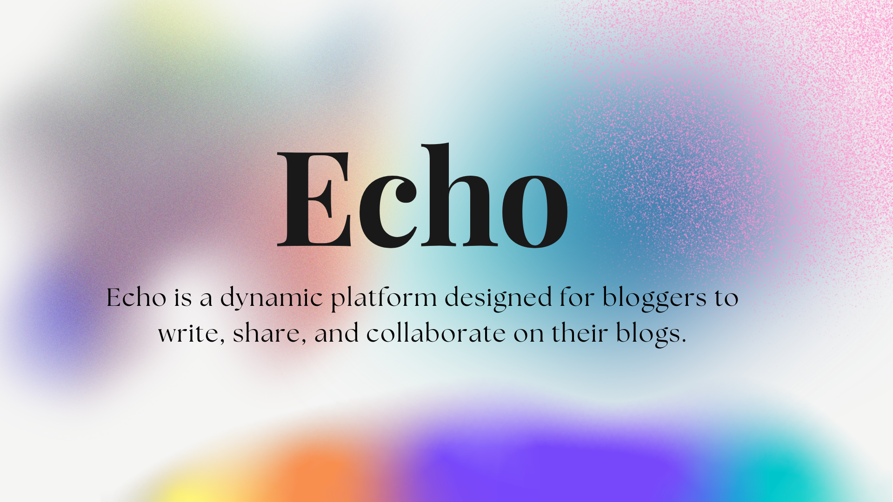

<picture>
  
</picture>

<h3>Open source medium alternative</h3>

[Instagram](https://instagram.com/biswajitmalakarmeta) | [Website](https://linktr.ee/biiswajit) | [X](https://x.com/biswajittwt) | [LinkedIn](https://www.linkedin.com/in/biswajitin/)

## Introduction

Echo is a dynamic platform designed for bloggers to write, share, and collaborate on their blogs.
Whether you're writing individually or as part of a group, Echo provides a seamless experience to craft and distribute your content.
Engage with your audience, collaborate with fellow writers, and amplify your voice with Echo.
Join the community of bloggers who are making an impact, one post at a time.

## Thanks to these awesome projects

- [Next.js](https://nextjs.org/)
- [Auth.js](https://authjs.dev/)
- [Prisma](https://www.prisma.io/)
- [React.js](https://react.dev/)
- [PostgreSQL](https://www.postgresql.org/)
- [Docker](https://www.docker.com/)